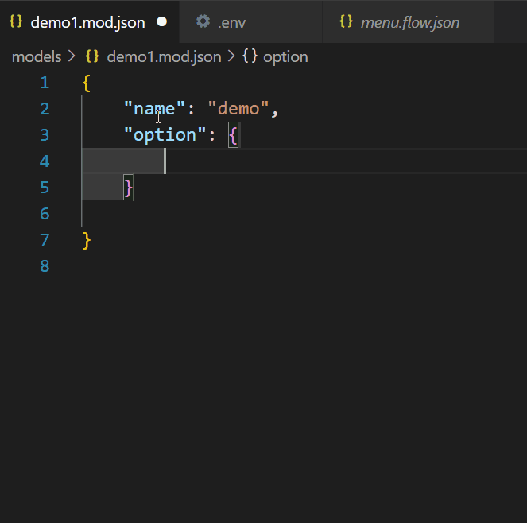

# YAO 应用 JSON-SCHEMA

开发 yao 应用需要频繁的编写 json 格式的配置文件。文件的配置项又特别的多，如果没有辅助工具，写起来比较累。而目前想到比较好的方法是使用 json-schema 文件帮助校验 json 语法，并且在 vscode 中使用 json-schema 也可以进行语法提示与自动完成。

本项目整理了 yao 应用中常用配置文件的 typescript 类型，并使用工具生成对应的 json-schema 文件。配置好 vscode 编辑器后测试使用效果还是不错的。

测试效果:

- 检验 json 配置文件的有效性

- 编辑器自动完成与代码提示



**此项目非官方文档，有可能部分信息不准确，仅供参考学习**

yao 应用引擎目前有 3 个发行版本:0.10.2/0.10.1/0.9.1，还有正在开发中的开发版本 0.10.3。

_注意_：0.10.3 与 0.10.2 在 dsl 配置文件的语法格式上存在差异。这里的 json-schema**并不适用于**目前官方发布的 0.10.2 版本，**只适用于 0.10.3 版本的开发版本**。

发行版本可以在官方上下载，开发版本需要从 github 的 action 中下载。

发行版本地址：https://yaoapps.com/release

开发版本：https://github.com/YaoApp/yao/actions

如何确定当前使用的是哪一个版本的 yao,请执行命令 yao version

```sh
yao version

0.10.3
```

## 使用方法

需要使用 vscode 编辑器

### 在线配置文件

直接使用 github 上的文件，优点是不需要下载 json-schema 文件,但是前提是电脑的网络能够直接连接到 github。

切换到 yao 应用目录执行以下命令。

```sh
mkdir .vscode
wget https://raw.githubusercontent.com/wwsheng009/yao-app-ts-types/main/.vscode/settings-online.json -O .vscode/settings.json
```

### 本地 json-schema 文件

- 下载项目中的 json-schema 文件夹中所有的配置文件到本地
- 下载项目中.vscode/settings.json 到本地目录.vscode/settings.json，这会对项目内所有的配置文件生效
- 如果只是效验单个文件，也可以在需要编辑的 json 文件中加入字段 "$schema"引用对应的 json-schema 文件
  ```json
  {
    "$schema": "../../../json-schemas/0.10.3/flow.json"
  }
  ```

## 目前支持的 yao DSL 列表

- 表单: form 文件
- 表格: table 文件
- 模型: model 文件
- HTTP API: http api 文件
- 流程: flow 文件
- Chart: 图表文件
- Dashboard: 大屏文件
- Connector: 数据库连接器
- Store: 存储
- List: 列表
- Login: 用户登录配置
- App: 应用信息
- Service
- Web socket
- Socket _官方还没支持_
- Task: 并发任务
- Widget: 自定义 widget

## 如何增加自定义的类型或是进行扩展

项目提供了一些内置处理器的 ts 类型定义与语法提示，方便用户理解 yao 的特有对象。

在目录 src/types/dsl 下包含了 yao 的各种 dsl 类型定义，每一个文件都包含了一种 DSL 类型的定义。用户可以根据自己的需要自行调整。

### 生成 json-schema 文件

完成 ts 类型定义后，可以使用工具生成对应的 json-schema 文件。生成的方式分两种：一个是单个生成会比较快，另外一个是批量生成，省事，但是会慢一点。

### 单个生成

利用工具 ts-json-schema-generator 生成 json-schema。

```sh
npx ts-json-schema-generator --path 'src/types/dsl/**/*.ts' --type 'YaoForm.FormDSL' >./json-schemas/yao-form1.json
```

### 批量生成

项目中提供了一个简单的批量生成的 bash 脚本，执行后会把所有的 ts 类型定义都转换成 json-schema 定义文件。

```sh
export_schemas.sh
```

## 其它

如果需要 vscode 支持后缀名为.yao 的配置文件

> - 使用 vscode 命令：更改语言模型/Change Language Mode,再修改文件类型关联。
> - 直接编辑 setting.json 配置

```json
 "files.associations": {
   "*.yao": "jsonc"
},
```

如果需要直接修改 json-schema,配置额外的配置，请参考：https://code.visualstudio.com/docs/languages/json
